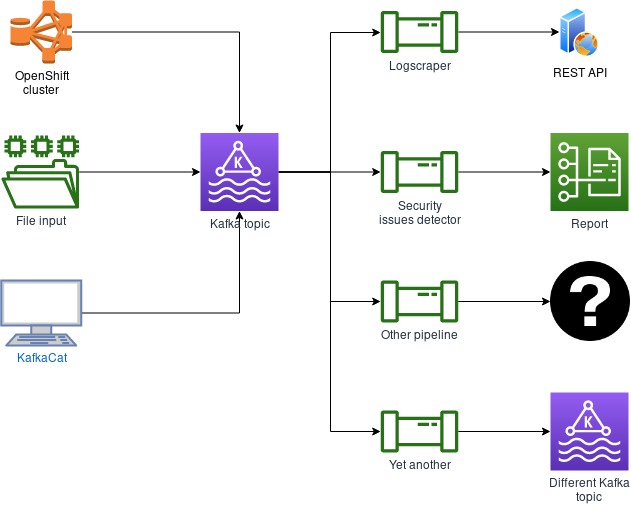

# Data pipeline architecture

## Integration with OCM

Customer Services are part of the overall workflow developed and deployed by the CCX team. Customers are now able to display information about their clusters in the OpenShift Cluster Manager (OCM). It is also possible to control their clusters through OCM. The plan for CCX team is to have a new tab in OCM to display information about clusters status (health, performance) based on results from insights rules.

## Overall architecture

1. Event about new data from insights operator is consumed from Kafka. That event contains (among other things) URL to S3 Bucket
1. Insights operator data is read from S3 Bucket and insights rules are applied to that data in `ccx-data-pipeline`
1. Results (basically organization ID + cluster name + insights results JSON) are stored back into Kafka, but into different topic
1. That results are consumed by `insights-results-db-writer` service 
1. `insights-results-db-writer` stores insights results into AWS RDS database
1. `insights-results-aggregator` provides such data via REST API to other tools, like OpenShift Cluster Manager web UI, OpenShift console, etc.

## Components overview

### ccx-data-pipeline

A hosted service that reads new insights data from S3 Bucket (based on events sent from Kafka).
Insights rules are applied to such data and result (in JSON format) is sent back into Kafka into different topic.

### insights-results-aggregator

A hosted service hosted that provides REST API endpoints for cached insights results.

### insights-results-db-writer

A hosted service that stores Insight OCP data that are being consumed by OpenShift Cluster Manager.
Insights OCP data are consumed from selected broker and stored in a storage (that basically works as a cache). The service is
based on the same code as insights-results-aggregator but runs with different parameters.
