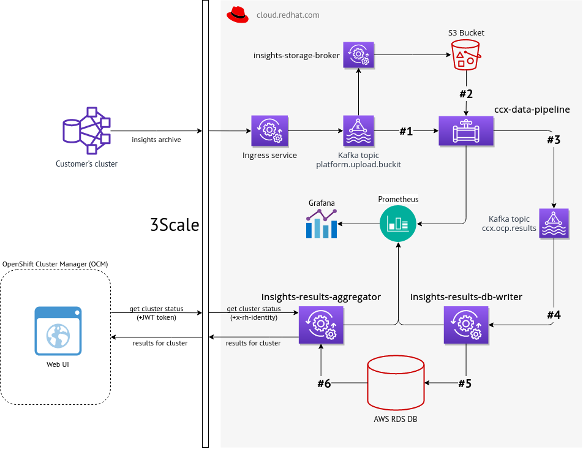

# Logscraper 

Webserver for log processing

## Log sources

Logs processed by *Logscraper* are produced by two services that are part of
one processing pipeline:

### CCX Data Pipeline

A service that reads new insights data from S3 Bucket (based on events sent
from Kafka). Insights rules are applied to such data and result (in JSON
format) is sent back into Kafka into different topic.

Incoming and outgoing Kafka topics are configurable, these can be even handled
by different Kafka instances.

Source codes of this service are available at <https://github.com/RedHatInsights/ccx-data-pipeline>

### Insights Results Aggregator

*Insights Results Aggregator* is a service that provides Insight OCP data that
are being consumed by OpenShift Cluster Manager. That data contain information
about clusters status (especially health, security, performance) based on
results generated by Insights rules engine. Insights OCP data are consumed from
selected broker (usually Kafka), stored in a storage (that basically works as a
cache) and exposed via REST API endpoints.

Source codes of this service are available at <https://github.com/RedHatInsights/insights-results-aggregator>

### Whole data flow based on CCX Data Pipeline and Insights Results Aggregator

The whole data flow is [described there](Pipeline.md)

### Documentation for Transformation of Log Files to JSON

Two examples for aggregator logs and one for pipeline logs are given: <https://github.com/cloudhubs/logscraper/blob/master/docs/Transformations.md>

